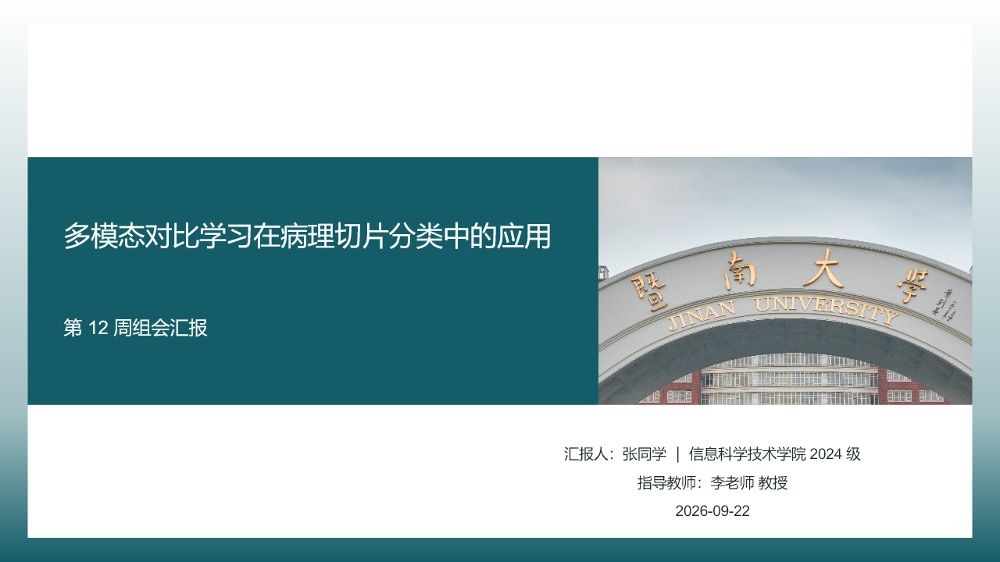
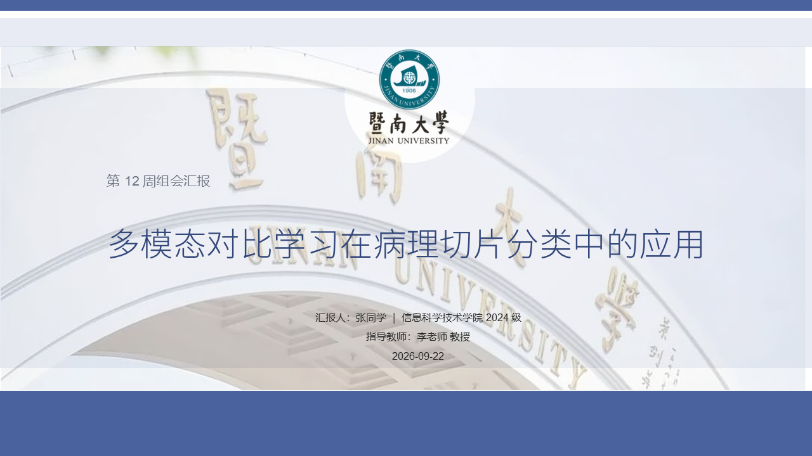
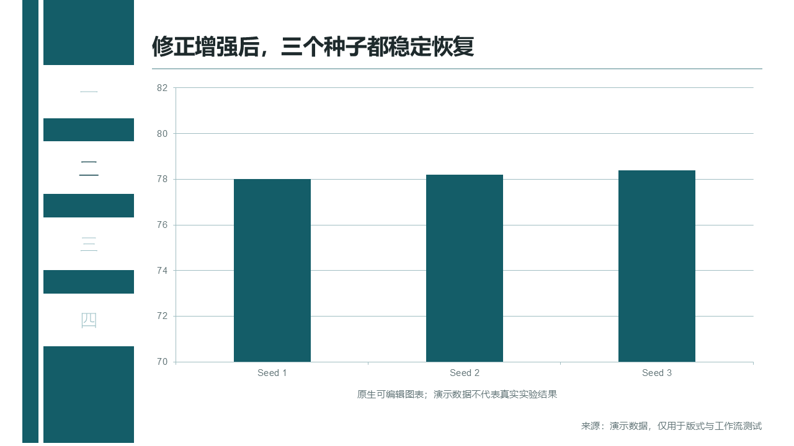
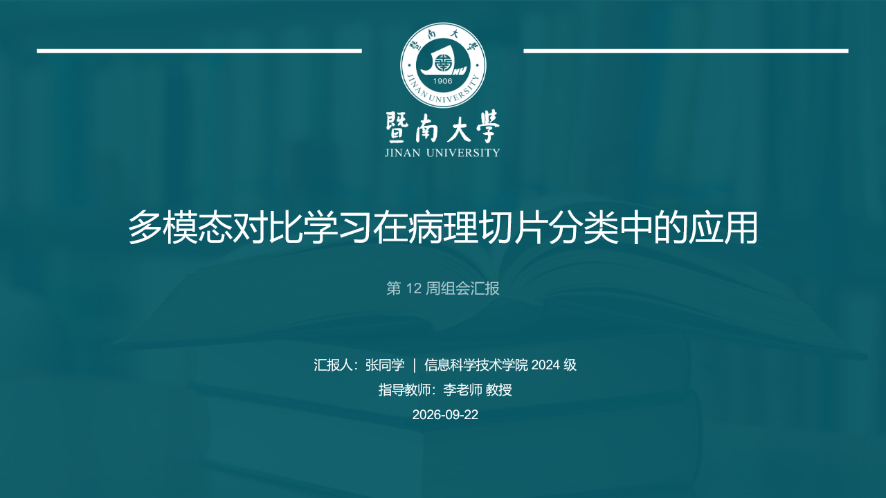
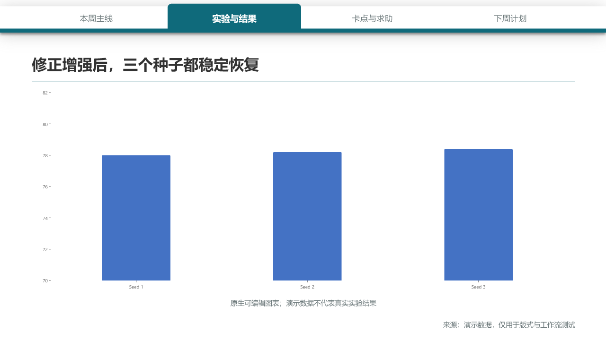
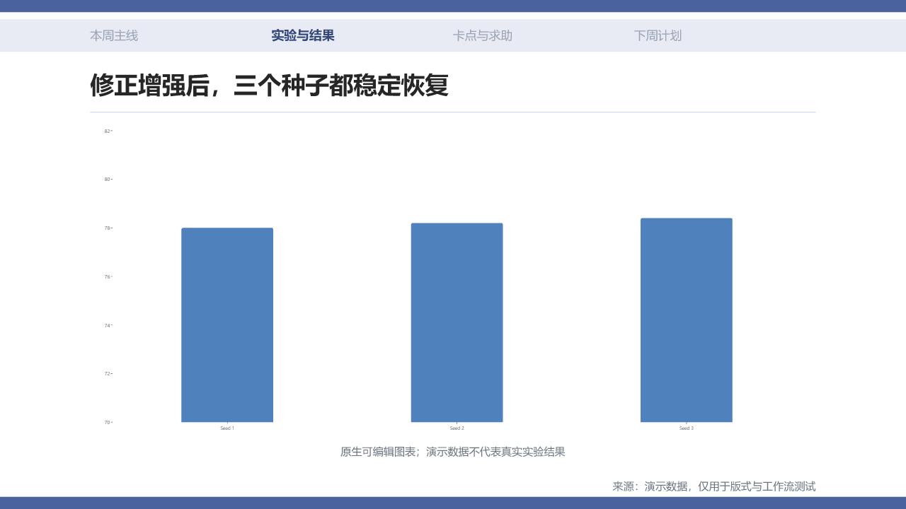
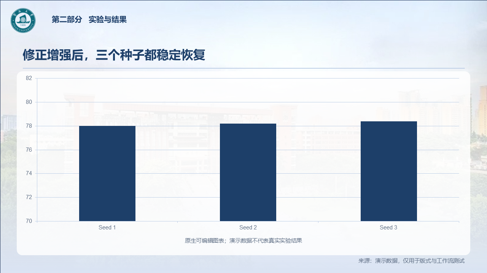
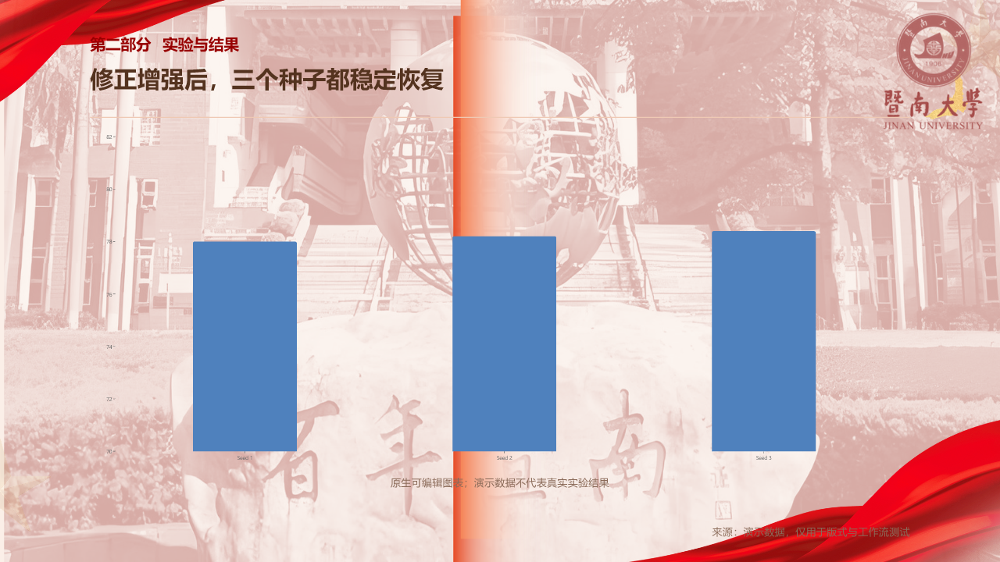

# 暨大学术 PPT Skill

给 AI 助手用的暨南大学学术汇报技能：把**一周的流水账、素材文件夹、论文 PDF 或口述**整理成讲得清、有证据的汇报，再套用暨大主题生成**可编辑的 .pptx**，并附上模拟导师问答。

适用于每周组会、论文精读、开题、中期、毕业答辩和竞赛答辩。支持 **Claude Code / Claude 桌面版**、**OpenAI Codex**，以及任何能运行 Python 的 AI 助手。

<p align="center">
  
  
</p>

---

## 不用 AI？直接下载 PPT 模板

五套暨大 PowerPoint 模板（.pptx）都放在 [`templates/`](templates) 文件夹里，**不装技能也能直接下载使用**，用 PowerPoint 或 WPS 打开后替换文字即可。

| 模板（点击进入下载页） | 风格 | 适合场合 | 页数 | 对应技能主题 |
|---|---|---|---|---|
| [暨大PPT模板1-清爽简洁.pptx](templates/%E6%9A%A8%E5%A4%A7PPT%E6%A8%A1%E6%9D%BF1-%E6%B8%85%E7%88%BD%E7%AE%80%E6%B4%81.pptx) | 蓝色渐变、校园实景 | 社团、活动汇报 | 7 | `jnu-crisp` |
| [暨大PPT模板2-大气通用.pptx](templates/%E6%9A%A8%E5%A4%A7PPT%E6%A8%A1%E6%9D%BF2-%E5%A4%A7%E6%B0%94%E9%80%9A%E7%94%A8.pptx) | 墨青、左侧章节导航 | 组会、论文精读 | 18 | `jnu-teal` |
| [暨大PPT模板3-红色主题.pptx](templates/%E6%9A%A8%E5%A4%A7PPT%E6%A8%A1%E6%9D%BF3-%E7%BA%A2%E8%89%B2%E4%B8%BB%E9%A2%98.pptx) | 红绸、百年暨南 | 党团、思政活动 | 5 | `jnu-red` |
| [暨大PPT模板4-蓝色简约.pptx](templates/%E6%9A%A8%E5%A4%A7PPT%E6%A8%A1%E6%9D%BF4-%E8%93%9D%E8%89%B2%E7%AE%80%E7%BA%A6.pptx) | 深青、顶部标签页 | 开题、中期、竞赛答辩 | 6 | `jnu-defense` |
| [暨大PPT模板5-严谨有序.pptx](templates/%E6%9A%A8%E5%A4%A7PPT%E6%A8%A1%E6%9D%BF5-%E4%B8%A5%E8%B0%A8%E6%9C%89%E5%BA%8F.pptx) | 蓝紫、中英双语 | 毕业论文答辩 | 6 | `jnu-rigor` |

进入文件页后点右上角的下载按钮（Download raw file）即可；也可以点绿色的 **Code → Download ZIP** 一次性下载全部。各模板的样子见下文的 [五套主题](#五套主题) 预览。

> **字体说明**：为了控制体积，模板里没有内嵌字体。模板 3、5 用到的**思源宋体 / 思源黑体**是免费开源字体，可从 [Adobe Fonts 的 GitHub](https://github.com/adobe-fonts) 下载安装；没安装时 PowerPoint 会自动用系统字体代替，排版可能略有变化。模板 5 的英文标题原本使用商业字体 Akzidenz-Grotesk，未安装时会显示为替代字体。

## 它和"让 AI 直接做个 PPT"有什么不同

- **先理清主线，再做页面。** AI 会先把你的材料整理成"进展 → 证据 → 卡点 → 下一步"（组会）或"背景 → 方法 → 结果 → 不足"（答辩），在对话里给出每页标题，确认后再生成。
- **不编数字。** 结论、指标、引用都必须能追溯到你给的材料；信息不够时 AI 会追问或做短版，不会注水。
- **五套暨大主题。** 背景、校徽、导航都来自学校发布的 PPT 模板；正文用原生形状绘制，文字、表格、图表都可以在 PowerPoint 里直接改。
- **交付前自检。** 自动检查缺图、模板占位字残留、文字溢出和越界、字号过小、对比度不足、图片模糊或变形、单页字数过多。缺图会直接中止导出，不会把占位框当成品交给你。
- **模拟导师问答。** 组会 5–8 题、答辩 8–12 题，逐题写"可能怎么问 / 建议怎么答 / 你还缺什么"。完整版在对话里给出，精简版会写进结尾页备注。

## 安装

先把仓库下载到本地：

```bash
git clone https://github.com/LiGonghao3/jnu-academic-ppt-skill.git
```

真正的技能是仓库里的 `jnu-academic-ppt/` 文件夹，按你用的 AI 助手把它放到对应位置：

| 助手 | 放到哪里 |
|---|---|
| Claude Code（个人全局） | `~/.claude/skills/jnu-academic-ppt/` |
| Claude Code（只在某个项目里用） | `<项目>/.claude/skills/jnu-academic-ppt/` |
| OpenAI Codex | `~/.codex/skills/jnu-academic-ppt/` |
| 其他支持 Agent Skills 的助手 | 按该助手的技能目录放置；或者直接让它阅读 `jnu-academic-ppt/SKILL.md` |

Windows 用户把 `~` 换成 `C:\Users\<你的用户名>`。想随仓库更新，可以用符号链接代替复制：

```powershell
# PowerShell（可能需要管理员权限或已开启开发者模式）
New-Item -ItemType SymbolicLink -Path "$HOME\.claude\skills\jnu-academic-ppt" -Target "<仓库路径>\jnu-academic-ppt"
```

### Python 依赖

在 Claude Code 或本地命令行里生成 PPT 需要 Python 3.9 及以上版本：

```bash
python -m pip install -r jnu-academic-ppt/requirements.txt
```

> Windows 提示：如果输入 `python` 弹出了微软商店，说明它只是占位程序。请改用 `py`、Anaconda，或从 [python.org](https://www.python.org/downloads/) 安装 Python。

Codex 会优先使用它自带的演示文稿和生图能力，通常不需要你额外配置 Python 或 API Key。

## 怎么用

装好后直接对 AI 说话即可，例如：

> 帮我用暨大主题做这周组会的 PPT，10 分钟，导师和同门听。材料在 `第12周流水账.md`。

> 把这篇论文做成精读汇报，重点讲方法和它对我们组的启发。

> 我要做毕业答辩，这是论文和实验图的文件夹，帮我先出大纲。

只有你明确提到"暨大风格"或本技能的主题时，它才会启用；普通商务 PPT 不会误触发。

### 四种准备材料的方式

1. **每周随手记（推荐）**：复制 [`assets/weekly-template.md`](jnu-academic-ppt/assets/weekly-template.md)，一周里有进展、数字、失败尝试时记一行，汇报前交给 AI。
2. **素材文件夹**：把实验截图、表格、代码输出、参考文献放进一个文件夹，告诉 AI 时长和听众。
3. **论文 PDF**：上传论文，说明为什么选它、最想讲哪部分、和你们组的工作有什么关系。
4. **直接口述**："这周干了什么、最重要的结论是什么、卡在哪、下周做什么"。

AI 每轮只会追问 2–4 个真正缺的信息，不会让你填一整张表。更详细的说明见 [用户教程](jnu-academic-ppt/references/user-guide.md)。

## 五套主题

| 主题 | 风格 | 默认用于 | 封面 | 内容页 |
|---|---|---|---|---|
| `jnu-teal` | 墨青、左侧章节导航 | 组会、论文精读 |  |  |
| `jnu-defense` | 深青、顶部标签页 | 开题、中期、竞赛答辩 |  |  |
| `jnu-rigor` | 蓝紫、中英双语 | 毕业论文答辩 |  |  |
| `jnu-crisp` | 蓝色渐变、校园实景 | 社团、活动汇报 |  |  |
| `jnu-red` | 红绸、百年暨南 | 党团、思政活动 |  |  |

同一份内容可以随时换主题重新生成；换主题后会重新自检，标题换行和图片裁切可能需要微调。

## 命令行用法（不经过 AI 也能用）

内容写在一份 `deck.json` 里，格式见 [deck.json 规范](jnu-academic-ppt/references/deck-schema.md)，可参考 [`examples/`](jnu-academic-ppt/examples) 里的组会和答辩示例。以下命令在仓库根目录运行：

```bash
# 生成 PPT
python jnu-academic-ppt/scripts/build_deck.py jnu-academic-ppt/examples/组会示例.deck.json --theme jnu-teal --out 组会.pptx

# 交付前自检（有 ERROR 时退出码为 1）
python jnu-academic-ppt/scripts/check_deck.py 组会.pptx --theme jnu-teal
```

| 脚本 | 作用 |
|---|---|
| `build_deck.py` | deck.json + 主题 → 可编辑 .pptx。缺图默认中止；调试版式时可加 `--allow-missing-assets` |
| `check_deck.py` | 11 项静态自检；Windows 装有 PowerPoint 时加 `--deep` 可实测文字外框 |
| `render_preview.ps1` | 用本机 PowerPoint 把每页导出成 PNG，加 `-Contact` 会拼一张总览图（仅 Windows） |
| `gen_figure.py` | 在没有原生生图能力时，调用 OpenAI 图像接口生成**概念示意图** |
| `smoke_test.py` | 全部主题 × 示例的冒烟测试和回归测试 |

`render_preview.ps1` 和 `--deep` 只会关闭它们自己启动的 PowerPoint，不会影响你已经打开的文件。

### 常用 deck.json 选项

- `meta.duration_minutes`：写 10 分钟以内时自动进入**紧凑模式**，省掉目录页和章节过渡页；也可以用 `meta.presentation_mode` 写 `"compact"` 或 `"standard"` 来强制指定。
- 顶层 `qa`：结构化的模拟问答，会以精简版（600 字以内，按整题取舍）写进结尾页备注。
- `layout: "chart"`：原生可编辑的柱状图、条形图和折线图，数据会嵌进 PPT 里的 Excel 工作簿。

### AI 生图

优先级：你自己的真实图片和实验输出 → 论文原图 → 助手自带的生图工具 → `gen_figure.py`。

```bash
python jnu-academic-ppt/scripts/gen_figure.py --check          # 检查接口配置
python jnu-academic-ppt/scripts/gen_figure.py "自注意力连接任意两个位置的示意图" --out 素材/attn.png --theme jnu-teal
```

API Key 只从环境变量 `OPENAI_API_KEY` 或技能目录下的 `.openai.json` 读取（已加入 `.gitignore`），也支持用 `base_url` 走中转服务。**AI 只能画概念示意图、流程图和装饰图，不能画实验结果、曲线或任何带具体数据的图**；图注需要标明"示意图（AI 生成）"。

## 设计原则

- **信息量适中**：普通内容页建议 80–180 字，至少说清"结论/主题、证据、解释"中的两项。结果页必须交代指标、基线、评测口径和来源。细节放备注或备份页。
- **可编辑优先**：正文、表格、图表都是原生对象；只有照片、论文原图和模板背景是图片。
- **诚实自检**：报告会区分"静态估算"和"PowerPoint 实测"，没实测过的不会写成已经实测。
- **备注不是唯一交付**：WPS、手机和导出的 PDF 可能看不到备注，所以模拟问答一定会在对话里完整给出。

## 仓库结构

```text
jnu-academic-ppt-skill/
├── README.md
├── LICENSE
├── templates/             # ← 五套暨大 PPT 模板，不用 AI 也能直接下载使用
├── .github/workflows/     # 自动冒烟测试
└── jnu-academic-ppt/      # ← 技能本体，安装时只需要这个文件夹
    ├── SKILL.md           # 技能入口（AI 读这个）
    ├── agents/openai.yaml # Codex 界面元数据
    ├── requirements.txt
    ├── assets/            # 周记模板、示例配图
    ├── examples/          # 组会、答辩示例 deck.json
    ├── references/        # 按需加载的详细规范
    ├── scripts/           # 生成、自检、预览、生图脚本
    └── themes/            # 五套主题：stencil.pptx + theme.json + 预览图
```

## 已知限制

- `--deep` 实测和 `render_preview.ps1` 需要 Windows 和桌面版 PowerPoint；其他环境只做静态估算，报告里会明确说明。
- 模板字体在别的电脑上可能被替换。去陌生电脑演示时，建议另存一份 PDF 备用。
- 换主题不能保证像素级一致，换完需要重新检查换行和图片裁切。

## 参与贡献

欢迎提 Issue 和 PR，比如新增主题、改进版式、修 bug。提交前请运行：

```bash
python jnu-academic-ppt/scripts/smoke_test.py
```

新增主题的流程（从原始模板提炼外壳、编写 `theme.json`、生成预览）见 [主题规范](jnu-academic-ppt/references/themes.md)。

## 许可与素材说明

代码和文档采用 [MIT 许可](LICENSE)。

`templates/` 中的模板文件，以及 `themes/` 中的背景、校徽、校园照片和版式设计，均来自暨南大学发布的 PPT 模板，相关权利归原权利人所有，不在 MIT 许可范围内，请在符合学校规定的场合使用。本项目为学生自发的开源工具，并非暨南大学官方项目。
