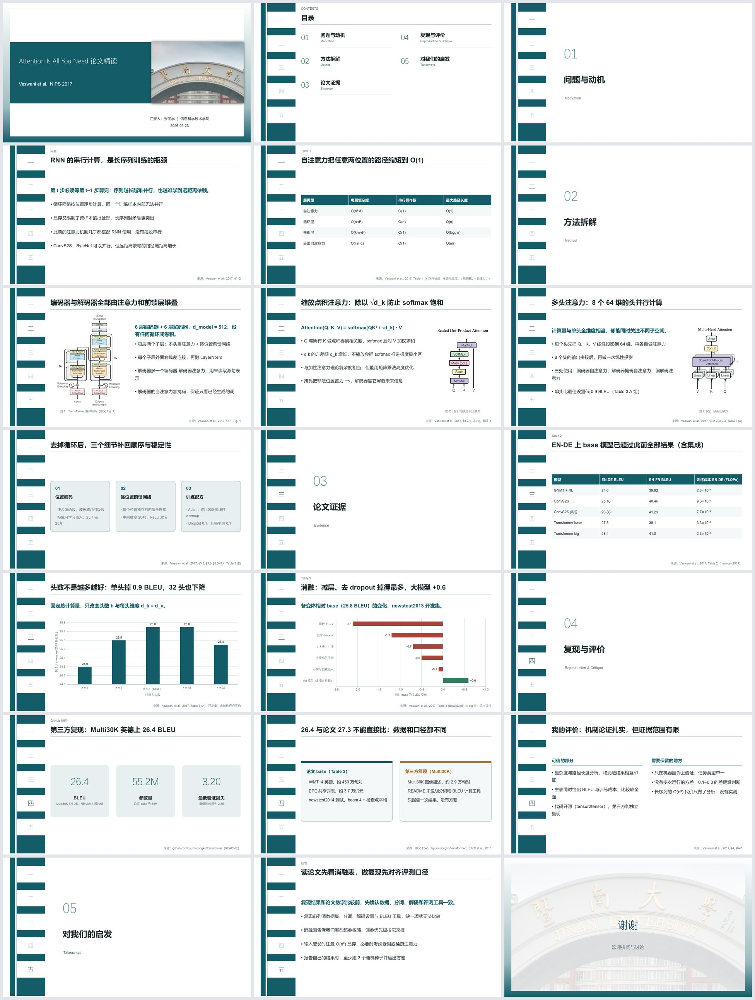

# 示例：Attention Is All You Need 论文精读

用本技能为 Vaswani et al.（NIPS 2017）做的一份约 20 分钟的论文精读汇报。同一份内容分别套用了四套主题，四份 .pptx 都可以直接下载，用 PowerPoint 打开编辑。

| 文件 | 主题 |
|---|---|
| [Transformer精读_大气通用.pptx](Transformer%E7%B2%BE%E8%AF%BB_%E5%A4%A7%E6%B0%94%E9%80%9A%E7%94%A8.pptx) | `jnu-teal`（论文精读默认主题） |
| [Transformer精读_蓝色简约.pptx](Transformer%E7%B2%BE%E8%AF%BB_%E8%93%9D%E8%89%B2%E7%AE%80%E7%BA%A6.pptx) | `jnu-defense` |
| [Transformer精读_严谨有序.pptx](Transformer%E7%B2%BE%E8%AF%BB_%E4%B8%A5%E8%B0%A8%E6%9C%89%E5%BA%8F.pptx) | `jnu-rigor` |
| [Transformer精读_清爽简洁.pptx](Transformer%E7%B2%BE%E8%AF%BB_%E6%B8%85%E7%88%BD%E7%AE%80%E6%B4%81.pptx) | `jnu-crisp` |



## 结构

21 页，按技能的论文精读骨架分成五章：

1. **问题与动机**：RNN 串行计算的瓶颈；自注意力的复杂度与路径长度（原文 Table 1）
2. **方法拆解**：整体结构、缩放点积注意力、多头注意力，以及位置编码等细节（原文 Fig. 1–2）
3. **论文证据**：主结果与训练成本（Table 2）、头数实验和消融（Table 3，做成了原生可编辑图表）
4. **复现与评价**：一份 GitHub 第三方复现的结果，以及它为什么不能直接和论文数字比较
5. **对我们的启发**

每页的讲稿提示和数据出处都写在 PPT 备注里。

## 数据来源

- 论文：Vaswani et al., *Attention Is All You Need*, NIPS 2017。图 1、图 2 从原文 PDF 以 576 dpi 裁出，所有数字取自原文 Table 1–3。
- 第三方复现：[hyunwoongko/transformer](https://github.com/hyunwoongko/transformer)，一份个人从零实现的 PyTorch 版本，README 报告在 Multi30K 英德数据上得到 26.4 BLEU。
- 汇报人"张同学"、学院等信息为占位示例。

## 模拟导师问答

完整 8 题见 [模拟导师问答.md](模拟导师问答.md)。

## 自己重新生成

`attention.deck.json` 是这份汇报的全部内容，`figures/` 是引用的原文配图。在仓库根目录运行：

```bash
python jnu-academic-ppt/scripts/build_deck.py examples/attention-is-all-you-need/attention.deck.json --theme jnu-teal --out 精读.pptx
python jnu-academic-ppt/scripts/check_deck.py 精读.pptx --theme jnu-teal
```

把 `--theme` 换成 `jnu-defense`、`jnu-rigor`、`jnu-crisp` 或 `jnu-red`，就能得到其他风格的版本。
